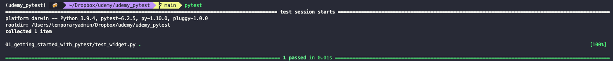
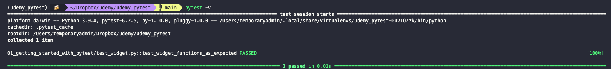
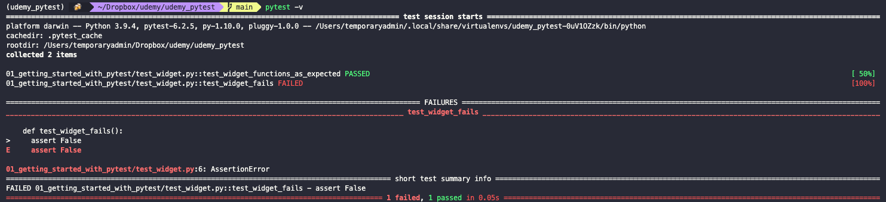
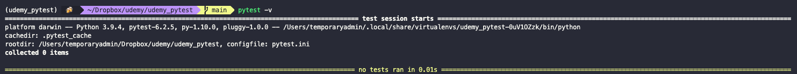

# Getting started with Pytest

To create a test we define a test function just like we would any other Python function (`def`). We save this function
in a file called `test_*`. Then to run our tests we open the terminal and run `pytest`. Pytest will search our directory
for test files and run them. The output will consist of a list of tests that were run. If next to the name of the test
file we get a green dot, then the test was successful. After all the tests are run, `pytest` will print a summary of
results and the time it took to run all the tests.



If we add the `-v` flag to the command, `pytest` will output a more verbose output that will actually print the word
`PASSED` for passed tests.



When a test fails, `pytest` will print a `FAILED` message next to the test (or an `F` is not using the verbose flag).
Below the complete list of tests, all the failed tests will be printed along with the line in which the test failed.



`pytest` uses some internal logics to try and guess which of our functions in the test files are actual tests
(sometimes we need to include mock data or auxiliary functions that we don't want to test). If the function starts with
the name `test` then it will be evaluated.

If we want to change this default behaviors of `pytest` we need to create a `pytest.ini` file and include our
configurations there.

In this `ini` file we need to add the `[pytest]` section. We can then add our configurations:

```ini
[pytest]
python_files = test_*
python_classes = *Tests
python_functions = test_*
```

The `python_files` rule is telling `pytest` that files who's name is of the form `test_*` are test files.

Similarly, the `python_functions` rule is telling `pytest` that functions who's name is of the form `test_*` are test
functions.

The `python_classes` rule is telling `pytest` that all classes that end with the `Tests` word in there name, are tests
(usually bundles of tests, thus the plural form).

This are the `pytest` defaults. If, for example, we change them to `check` (while keeping our files and functions with
`test`), then `pytest` will not be able to find our tests.

```ini
[pytest]
python_files = check_*
python_classes = *Checks
python_functions = check_*
```


