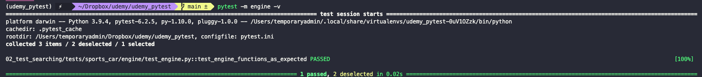
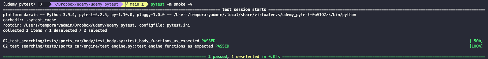
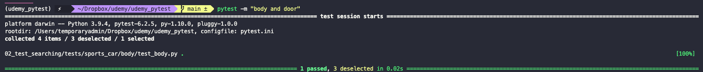
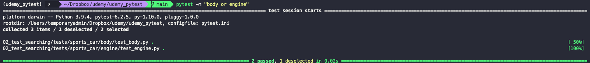
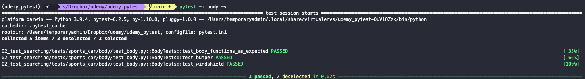

# Test searching

**Test searching** is the ability of `pytest` to find tests in your repository, as long as they follow the naming patterns specified in `pytest.ini` configuration file.

The goal is to achieve a test suite that is readable and understandable by everybody on the team. One best practice is to organize tests using directories. In the root of the project we start with a directory called `tests`. Inside of it we can place as many sub-directories (and sub-sub-directories, and so on) as needed. Each of these should contain the tests for a specific logic unit of functionality in our project.

``` txt
<project-dir>
  |
  |_ bin
  |_ src
  |_ docs
  |_ tests
  |   |_ <module-name>
  |   |   |_ test-something.py
  |   |   |_ test-something-else.py
  |   |   |_ ...
  |   |_ ...
  |_ README.md
  |_ .gitignore
  |_ ...
```

Sometimes we don't want to run the entire suite. To mark what to run and when we use `markers`. These `markers` allow us to mark a group of tests as belonging to a certain group by using Python decorators. For example, we are marking the below test as belonging to the `engine` set of tests.

``` py
from pytest import mark

@mark.engine
def test_engine_functions_as_expected():
  assert True
```

It's preferable to over mark (that is,s define marks that we then don't really use), than to under mark tests. Marks are basically for free. If we now want to only run the tests marked `engine` we run:

``` bash
pytest -m engine
```



If the marker is not registered in the `pytest.ini` configuration file, `pytest` will through a warning letting you know that there are tests that don't have the requested marker. To register a `mark` just add it to the `pytest.ini` as shown bellow

```ini
[pytest]
markers =
  engine: marks tests as belonging to the engine set of tests (deselect with '-m "not engine"')
```

We can also add more than one mark to our test. This become really handy when marking *smoke tests*, or *regression tests*, etc.



With this, we only need to add or remove markers to add or remove tests to specific suites.

## Running multiple marks

We can use set keywords `and` and `or` to run tests with multiple or different marks. For example, if we run `"body and door"`, `pytest` will run only tests that have both the `body` and the `door` marks:

``` bash
pytest -m "body and door"
```



If instead we run `"body or engine"` then `pytest` will run all test with mark `body` and all tests with mark `engine`

``` bash
pytest -m "body or engine"
```



We can also use `not` to prevent specific tests from running

``` bash
pytest -m "not engine"
```

## Using classes

Sometimes we need to give a large number of tests the same mark (plus some additional marks more specific to each test, or smaller subsets of them). We can avoid this by creating a class and marking that class. Each test function now becomes a method in that class and thus needs a `self` parameter.

``` py
@mark.body
class BodyTests:
  
  @mark.door
  def test_body_functions_as_expected(self):
    assert True
  
  def test_bumper(self):
    assert True
  
  def test_windshield(self):
    assert True
```

I can now run `pytest -m <mark_name>` and all tests in that class will be run.


