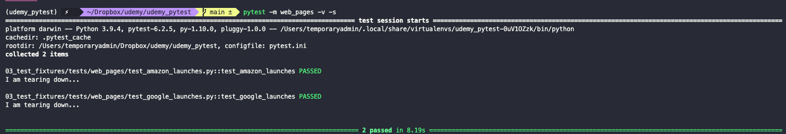

# Test fixtures

Sometimes multiple of our tests require the same boilerplate code to be used. To avoid repetition we use `fixtures`. To do so, first we need to create a `conftest.py` script. Every test in every file that is located in a child directory of the directory that holds the `conftest.py` script can access it. We generally use this functions to set up environments like access to DBs, or utility functions like launching a browser.

In this file we will place some helper functions that rids us of having to write and re-write all our boilerplate code. Thanks to some `pytest` magic, we don't even have to import the functions to the `test_*` script. To signal that a function in `conftest.py` is a `fixture` we use the `@fixture` decorator.

``` py
@fixture
def chrome_browser():
  chrome_browser = webdriver.Chrome() 
  return chrome_browser
```

Each fixture needs to be scoped. Possible scopes are:

- `function`: means that the fixture will only be used once per function. This is the default value. For example, in our fixture that sets up a Chrome browser, each function will use a separate instance of the browser. If we try to instantiate two browsers in the same function, `pytest` will ignore us and use the same browser that already has available.
- `class`
- `module`
- `package`
- `session`

Now we can use the fixture in any test that we may need it by including it as a parameter of the test function

``` py
@mark.web_pages
def test_google_launches(chrome_browser):
  chrome_browser.get("http://www.google.com")
  assert True
```

Fixtures can also handle their own tear down. If instead of using the keyword `return` we use the `yield` function, then everything that we include below it will be executed after the test has finished running.

``` py
@fixture(scope = "function")
def chrome_browser():
  chrome_browser = webdriver.Chrome() 
  yield chrome_browser
  
  # Teardown code
  print("\nI am tearing down...")
```

> Note: since we are using a simple print statement we will add the `-s` flag to the `pytest` command so that all output is actually printed and not cached. `-s` stands for *standard out*.

``` bash
pytest -m web_pages -v -s
```


