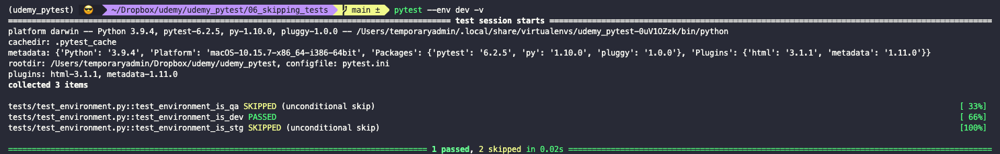
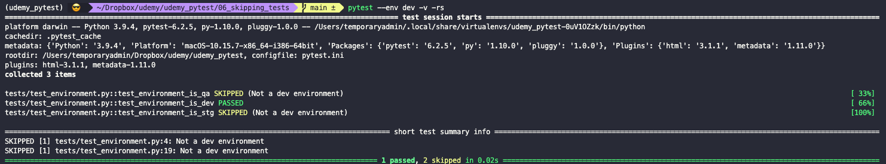
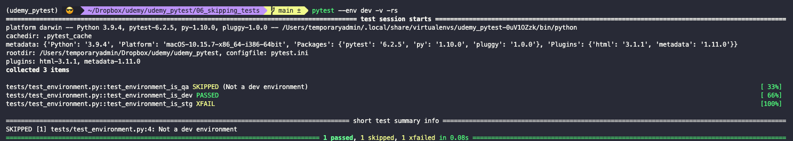
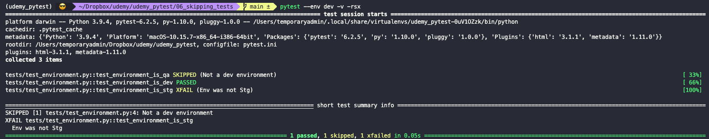

# Skipping tests

In general, tests should not be skipped. A test that is expected to fail or needs to be skipped should not be part of the test suite for long. If you don't have the time to fix it, then move it to a different branch. Production suite should only contain tests that work and add valuable information.

If you need to skip a test, with `pytest` you don't need to comment out the code. To do so, we use markers. We just need to add the `@mark.skip` decorator before a test and `pytest` will skip it. The output will inform that some tests where skipped so that the user of the test suite knows that something is not being tested.



The `skip` marker allows us to pass a reason that explains why the test was skipped. In order for reasons to be shown in the output, we need to add the flags `-rs`.

``` bash
pytest <other_arguments> -v -rs
```



## Expected failures

Problem up until now is that we have to hard code the `skip` instruction. But what if we want our test run to know which ones are expected to fail (for example, due to the environment in which they are running). We can use the `xfail` mark to achieve this.



Reasons why a test is expected to fail are not always obvious. We can use the `reason` argument here too to explain in the output, and use the `-rsx` flags so that they show up in the output.


