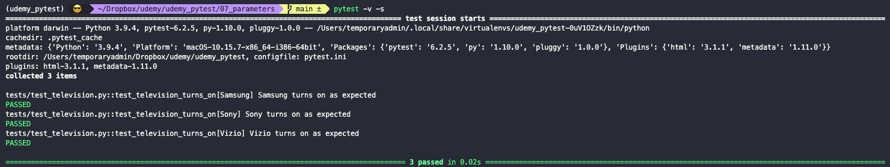
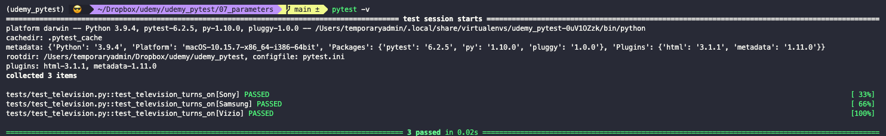

# Test parametrization

Test parametrization allows us to run the same test but with different inputs, without having to copy-paste the test code. To pass parameters to our tests we use the `@mark.parametrize` decorator. The parameters of the test code itself are declared in the function and then used in the function body (as usual). We also need to pass the parameter names as strings to the decorator, followed by the parameter values, using some Python iterable (for example, a list of tuples). `pytest` will run the test as many times as there are values to iterate over.

``` python
@mark.parametrize(
  "tv_brand",
  [
    ("Samsung"),
    ("Sony"),
    ("Vizio")
  ]
)
def test_television_turns_on(tv_brand):
  print(f"{tv_brand} turns on as expected")
```



One problem with this way of coding the tests is that if the list of values to iterate over now changes, then we need to change it in every test. We can use a `fixture` to solve this. For example, if we want our browser automated tests to be run for three different drivers (Chrome, Firefox and Edge), then our browser fixture can include all of them as parameters.

``` python
@fixture(params = [webdriver.Chrome, webdriver.Firefox, webdriver.Edge])
def browser(request):
  driver = request.param
  drvr = driver()
  yield drvr
  drvr.quit()
```

Alternatively, we can have a `JSON` file with all our test data. In our TV brands example, our `JSON` file would be an array of three elements (the TV brands we want to test for). In `conftest.py` we will load the data and create a fixture that uses that data.

``` python
def load_test_data(path):
  with open(path) as data_file:
    data = json.load(data_file)
    return data

@fixture(params = load_test_data(path))
def tv_brand(request):
  data = request.param
  return data
```

Because our data loading is now a fixture, we don't need to pass parameters to the test itself anymore.

``` python
def test_television_turns_on(tv_brand):
  print(f"{tv_brand} turns on as expected")
```


