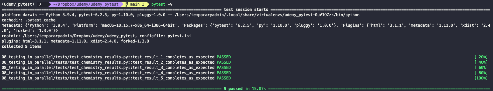
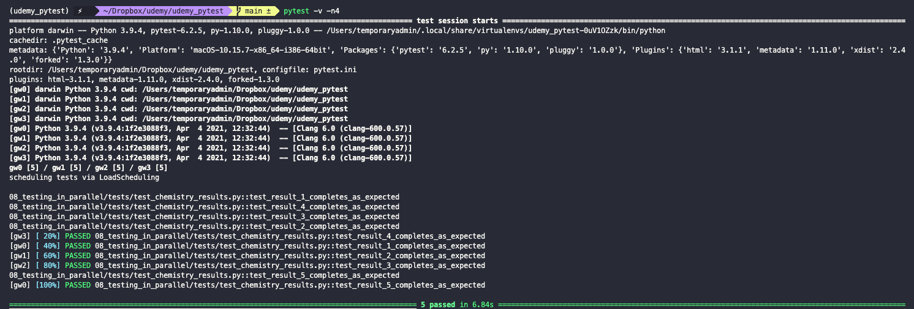
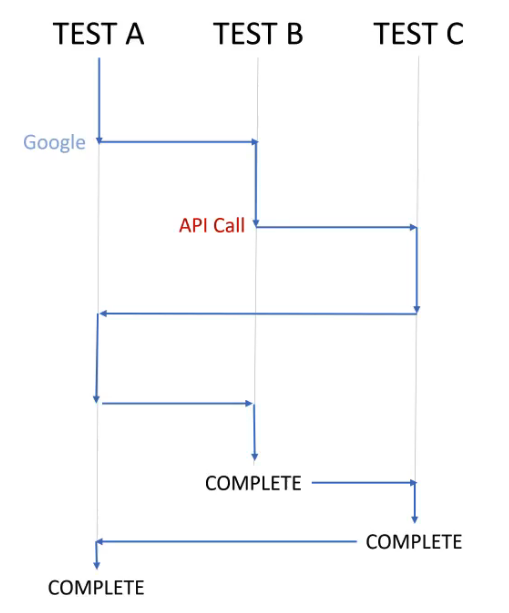
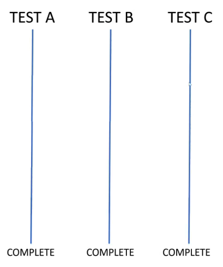

# Testing in parallel

Running tests in parallel makes our suite much faster. To do so, we just need to install the `pytest-xdist` add-on package with

``` bash
pipenv install pytest-xdist
```

With this new add on we can now add the `-n#` flag to our CLI command and specify the number of threads to be used for running the tests.

``` bash
pytest -v -n4
```

When we run this command, `pytest-xdist` will first have to do some setup. This means that using parallel processing might not reduce time if the test is very small (and might even increase it). But in general, complete testing suites are large enough that it is worth it.





Tests must be isolated from other tests in order for them to be able to be parallelized.

## Number of processors/threads

If we don't know how many processors or threads are optimal, we can use the `-nauto` flag to let `pytest` try to figure it out.

``` bash
pytest -v -nauto
```

## Threads versus processors

> **Threads** are concurrent (they run at the same time). **Processors** are concurrent and in parallel.

Suppose we have three tests (A, B, and C). `pytest` starts running Test A, but at some point it needs to request a resource from Google. Google will take some time to respond. This might just be 1 or 2 seconds, which is fast for humans, but it's usable time for the machine.

Instead of just sitting idle while Google responds, the Python interpreter will spawn a new thread, and start working with Test B and "pause" Test A. Now, suppose Test B needs to request a resource from an API and the same happens. Instead of waiting for the API to respond, Python will start a new thread, "pause" Test B, and move on to Test C.

The Python interpreter will continue jumping from test to test as bottle necks are encountered to maximize the time that it is actually doing work and not just sitting idle. But, at any point in time, only one test is actually running.

In technical terms, we use this approach when we are *I/O bound*. This just means that the bottle neck is not in house, but caused due to an external resource.



When code runs in parallel, each thread is spawn on its own core and uses its own memory, disk, and other resources it might need. There is not communication between them and (in general) no way of sharing results.

In technical terms, we use this approach when we are *CPU bound*. This might happen due to complexity of our test, or due to inefficiencies in it.



The number of parallel process that we can start is limited by the number of cores that we have available. The number of threads that we can start is limited by the memory that we have available.

By default, `pytest` will try to start new process. But if the number of processes that we are requesting from it is higher than the number of cores, then it will start new threads inside the same cores.
