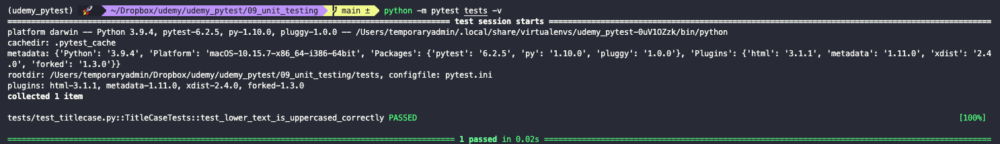

# Unit testing

> **Unit testing** is about testing the smallest pieces of our code base (called units), such as functions. They have to be very small in scope.

We can keep unit tests right next to the code base since there are no external dependencies in unit testing. Other tests might require their own repositories. A related concept to unit testing is *Test Coverage*. This is the percentage of units that are covered by our testing suite. Ideally, we would get 100% test coverage.

The convention is that all unit tests will be stored in a child-directory of the root of your project, called `tests`. It must be outside of the installable modules.

``` txt
proj-name
  |
  |_ tests
  |   |_ pytest.ini
  |   |_ test_module.py
  |
  |_ module
  |   |_ __init__.py
  |   |_ ...
  |
  |_ setup.py
  |_ other_files
```

In side the `tests` directory, there should be one `test_*.py` file per module. Inside this files you can put the actual unit tests. If the module has itself more sub-dirs under it, then so should our `tests` directory.

Inside the `test_*.py` script, we should define classes that group the tests into a logical unit.

Because our `tests` directory now behaves like a module in our directory, we need to run it as such. To do so, we run:

``` zsh
python3 -m pytest tests -v
```


