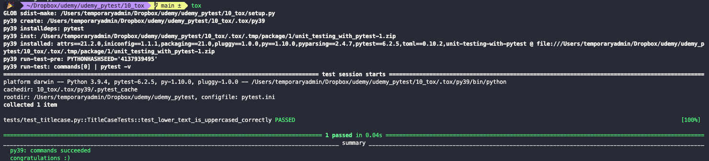
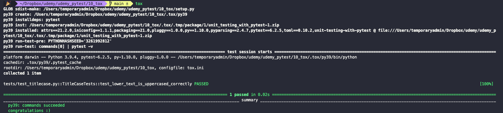

# Running unit tests with Tox

Tox is a tool that allows us to achieve separation of concerns between our units and their tests. Even the installation of `pytest` should not be part of the libraries and logics of our program (since it's not part of it per sé). Tox will create a virtual env for each environment in which we want our tests to run.

To install Tox, first make sure that the virtual environment of your project has been deactivated. Since Tox will create its own virtual envs, you don't want to install it inside a virtual env or it will cause it not nest environments.

``` bash
pip install tox
```

In order to configure Tox, we need to add `tox.ini` to the root directory of the project.

``` txt
proj-name
  |
  |_ tests
  |   |_ pytest.ini
  |   |_ test_module.py
  |
  |_ module
  |   |_ __init__.py
  |   |_ ...
  |
  |_ tox.ini
  |_ setup.py
  |_ ...
```

In it we need to include a list of testing environments under the `tox` header, and a list of test dependencies to install and commands to run under the `testenv` header. No code dependencies should be included here, only dependencies of the testing environment.

```ini
[tox]
envlist = py39

[testenv]
deps = pytest
commands = 
  pytest -v
```

To now run it, we just run the `tox` command in the CLI:

``` bash
tox
```



In order for it to work, make sure to include a `setup.py` file in your root directory. As should in the image above, Tox will create a virtual environment for each environment in which we told it to run the test suite. You can find the results of all of this in a new sub-dir called `.tox` in the root of the project.

Tox knows how to handle `pytest`. The implication here being that we can avoid having a `pytest.ini` and move the configurations that we included in it to the `tox.ini` file, under the `pytest` header.

``` ini
[tox]
envlist = py39

[testenv]
deps = pytest
commands = 
  pytest -v

[pytest]
python_classes = *Tests
python_functions = test_*
python_files = test_*
testpaths = tests
```

> Notice that we added the `testpaths = tests` key-value pair as well. We can do that in `pytest.ini` too. It controls which sub-directories `pytest` will scan. The objective been that, since we know where the tests are, we don't want to waist time searching in directories in which we know that there are no tests to be found.

We can now use the same `tox` command in the CLI and we'll see in the output, that the config file is now `tox.ini`, instead of `pytest.ini`.


